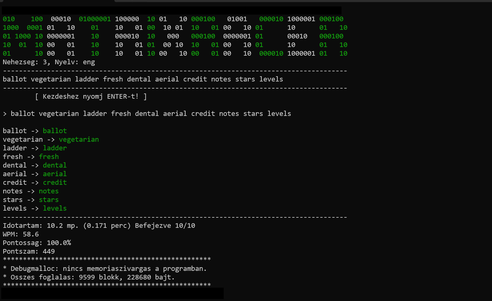

# Matrix Racer
This application is my submission for the homework assignment of the "Basics of Programming 1" subject at BME.


**Author:** Péter Sasvári  

## Overview

**Matrix Racer** is a terminal-based typing game where the player's task is to type the text appearing on the screen as quickly and accurately as possible, then finalize the attempt by pressing `Enter`.

Words must be typed one after another, separated by spaces, without pressing enter between them.  

After the game, statistics are displayed, including:

- **WPM** (words per minute)  
- **Elapsed time**  
- **Accuracy**  
- **Final score**

### Languages

The text to be typed can be in:

- **English**
- **Hungarian** (words without accents)

### Difficulty Levels

The game offers multiple difficulty levels. Depending on the level, the program reads from different dictionary files:

- **1** : short words (usually the most common words of the given language)  
- **2** : medium words + short words  
- **3** : long, medium, and short words  

## Usage

The program can be started standalone or with language/difficulty parameters.  

**Syntax:**
```bash
<program_name> <eng/hun> [1/2/3]
